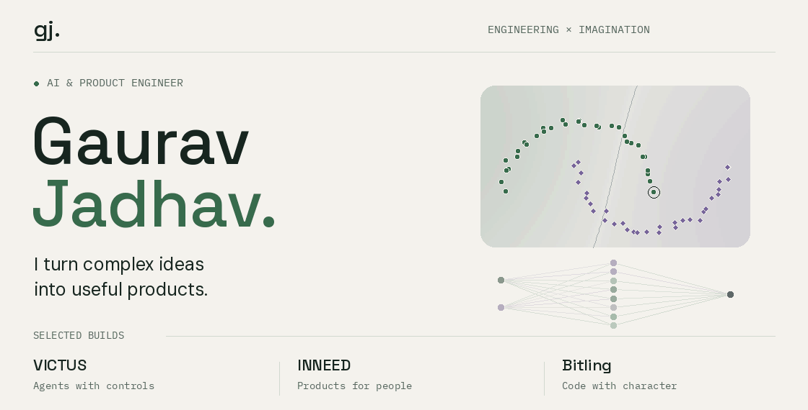

<picture>
  <source media="(max-width: 600px) and (prefers-reduced-motion: reduce) and (prefers-color-scheme:dark)" srcset="assets/intro-dark-mobile.png">
  <source media="(max-width: 600px) and (prefers-reduced-motion: reduce)" srcset="assets/intro-light-mobile.png">
  <source media="(prefers-reduced-motion: reduce) and (prefers-color-scheme:dark)" srcset="assets/intro-dark.png">
  <source media="(prefers-reduced-motion: reduce)" srcset="assets/intro-light.png">
  <source media="(max-width: 600px) and (prefers-color-scheme:dark)" srcset="assets/intro-dark-mobile.gif">
  <source media="(max-width: 600px)" srcset="assets/intro-light-mobile.gif">
  <source media="(prefers-color-scheme:dark)" srcset="assets/intro-dark.gif">
  
</picture>

**Full Stack AI Engineer at Alsonotify, a Digibranders brand · Mumbai**

I build AI products and the systems around them: retrieval, agents, APIs, and the interfaces people use. I care about what happens after the first successful demo—whether answers are grounded, actions are controlled, and the product holds up when something fails.

**[Portfolio](https://jadhavgaurav.github.io)** · **[LinkedIn](https://www.linkedin.com/in/gauravjadhav007)** · **[Email](mailto:gaurav.vjadhav01@gmail.com)**

## Engineering in practice

**OyeChats · AI product engineering** 
My contributions include fixing a relevance gate that excluded useful knowledge-base content, consolidating duplicated RAG pipelines, and moving qualification work onto a durable job queue. The prompt consolidation documented in the remediation PR reduced one assembled prompt from **15,233 to 8,120 tokens**. 
[Retrieval diagnosis](https://github.com/digibranders/oye-chats-platform/pull/450) · [Prompt, streaming & durability work](https://github.com/digibranders/oye-chats-platform/pull/455)

**CleanStart · Product performance and correctness** 
I batched CMS relationship lookups and fixed cache invalidation that could run before a database write committed. For the documented 25-row list, the change reduces roughly **75 relationship requests to 2**. 
[CMS performance](https://github.com/digibranders/cleanstart-web/pull/279) · [Cache correctness](https://github.com/digibranders/cleanstart-web/pull/276)

## Selected builds

<table>
<tr>
<td width="50%" valign="top">
<h3><a href="https://github.com/jadhavgaurav/victus-backend">VICTUS</a></h3>

A document-aware assistant built around tools, policy decisions, approval controls, and execution traces. Making an agent's actions inspectable is part of the product.

AI orchestration · Retrieval · Tool policies

<a href="https://github.com/jadhavgaurav/victus-backend">Backend</a> · <a href="https://github.com/jadhavgaurav/victus-frontend">Frontend</a> · <a href="https://github.com/jadhavgaurav/PROJECT-VICTUS">Original project</a>

</td>
<td width="50%" valign="top">
<h3><a href="https://github.com/jadhavgaurav/bitling">Bitling</a></h3>

A desktop companion with a developer's working day: commits, test runs, deploys, and Claude Code sessions become little moments of character. Built primarily for macOS.

Developer tools · Native UI · Playful interaction

<a href="https://jadhavgaurav.github.io/bitling/">Try the browser demo</a> · <a href="https://github.com/jadhavgaurav/bitling">Source</a>

</td>
</tr>
<tr>
<td width="50%" valign="top">
<h3><a href="https://github.com/jadhavgaurav/inneed">INNEED</a></h3>

A rental marketplace that goes beyond listings: vendor onboarding, rental workflows, checkout, payment verification, disputes, and administration.

Full-stack product · Marketplace workflows · Payments

<a href="https://github.com/jadhavgaurav/inneed">Explore the source</a>

</td>
<td width="50%" valign="top">
<h3><a href="https://github.com/jadhavgaurav/multimodal-search-platform">Multimodal Search</a></h3>

Find images with a sentence or another image. CLIP embeddings and vector search connect a FastAPI backend to a React interface.

CLIP · ChromaDB · FastAPI · React

<a href="https://github.com/jadhavgaurav/multimodal-search-platform">Explore the source</a>

</td>
</tr>
</table>

More builds: [GitHub Mirror](https://github.com/jadhavgaurav/github-mirror), a GitHub-footprint explorer with deterministic visual signatures, and [explainable phishing detection](https://github.com/jadhavgaurav/CodeB_Internship_Project) with feature selection, SHAP, and LIME.

## Tools I reach for

**AI & data** — Python, FastAPI, LangChain, CLIP, ChromaDB, scikit-learn, PostgreSQL, Redis. 
**Product** — TypeScript, React, Next.js, Node.js, Tailwind CSS. 
**Delivery & experiments** — Docker, GitHub Actions, AWS, MLflow, DVC.

## Open source, along the way

I also send focused fixes upstream:

- **[llm-gateway](https://github.com/mnfst/llm-gateway/pull/2772)** — preserve Anthropic server-tool parameters when forwarding requests.
- **[Readest](https://github.com/readest/readest/pull/5905)** — make multi-device file sync converge.
- **[Pandoc](https://github.com/jgm/pandoc/pull/11877)** — restore the missing bar on a blockquote's first line in ANSI output.

[More contributions and project details →](https://jadhavgaurav.github.io/#open-source)

Background & earlier work

- **Full Stack AI Engineer, Alsonotify / Digibranders** — April 2026–present.
- **Data Science Intern, Code B Solutions** — February–April 2025.
- **Master in Data Science and Analytics with AI, IT Vedant with IBM** — June 2024–June 2025.
- **B.E. Computer Engineering, University of Mumbai** — 2024.
- **Published research:** [A Framework to Make Voting System Transparent Using Blockchain Technology](https://ijream.org/papers/IJREAMV10SSJ2411.pdf), IJREAM, April 2024.

Earlier projects include [computer vision for attendance](https://github.com/jadhavgaurav/Vision-X), [a CNN classification workflow with MLflow and DVC](https://github.com/jadhavgaurav/Kidney_disease_classification_cnn), and [an email assistant with human escalation](https://github.com/jadhavgaurav/smart-email-assistant-newel).

---

**Building something useful with AI? [Let's talk.](mailto:gaurav.vjadhav01@gmail.com)**

The intro shows a real training run on synthetic data. [How the animation is made](scripts/README.md).
